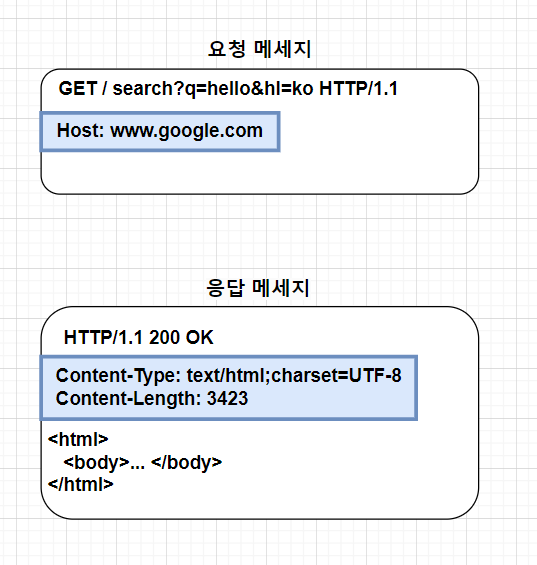

# HTTP 헤더

* HTTP 전송에 필요한 모든 부가 정보를 포함한다.
* 각각의 헤더 필드는 field-name과 field-value로 구성

# HTTP 헤더 - RFC2616(과거 스펙)

* General, Request, Response, Entity 헤더로 분류하는 것은 과거 HTTP/1.1 스펙에서 일반적
    * General Headers : 모든 요청과 응답에 공통으로 사용되는 헤더
      * Cache-Control, Connection 등이 있음
    * Request Headers: 요청에 사용되는 헤더
      * User-Agent, Accept 등이 있음
    * Response Headers : 응답에 사용되는 헤더
      * Server, WWW-Authenticate 등이 있음
    * Entity Headers: 요청이나 응답의 본문(Entity(과거 표현))과 관련된 헤더
      * Content-Type, Content-Length 등이 있음.
      * 즉, 엔티티 헤더는 엔티티 본문의 데이터를 해석할 수 있는 정보를 제공
        * 데이터 유형(html, json), 데이터 길이, 압축 정보 등

# HTTP 헤더 최신 스펙 변화 - RFC723x(최신 스펙)
* '엔티티(Entity)'에서 '표현(Representation)'이라는 명칭으로 바뀜
* 표현이란 리소스의 특정 상태나 조건을 "표현"하는 데이터
* 즉, 리소스는 웹 서버에 저장된 실제 정복 항목을 의미하며, 표현은 그 리소스의 특정 상태를 설명하거나 나타내기 위한 데이터와 메타데이터의 조합을 의미
* 표현 = 표현 메타데이터 + 표현 데이터
* HTTP 메시지의 본문은 페이로드(Payload)라고도 불림 (단, 완전 동일한 개념은 아니다)
  * 출처 - MDN web docs : https://developer.mozilla.org/ko/docs/Web/HTTP/Messages
* 표현 헤더는 표현 데이터를 해석할 수 있는 정보를 제공
  * 데이터 유형(html, json), 데이터 길이, 압축 정보 등등

## 표현 메타데이터
* Content-Type: 표현 데이터의 형식
  * 표현데이터의 미디어 타입을 명시
  * 예) Content-Type: text/html; charset=utf-8
  * 예) Content-Type: application/json
* Content-Encoding: 표현 데이터의 압축 방식
  * 표현 데이터가 어떤 방식으로 인코딩 됐는지 나타냄
  * 예) Content-Encoding: gzip
* Content-Language: 표현 데이터의 자연 언어
  * 표현 데이터의 대상 언어를 명시한다.
  * 다국어 웹사이트에서 유용하게 사용
  * 예) Content-Language: ko
* Content-Length: 표현 데이터의 길이
  * 표현 데이터의 크기를 바이트 단위로 명시
  * 이 정보는 클라이언트가 다운로드 시간을 예측할 때 유용
* 표현 헤더는 요청과 응답 둘 다 사용한다.

----------------------------------------------------------------------
# 협상(Content negotiation)
* 협상이란? 클라이언트와 서버 간에 리소스의 표현을 협상하는 메커니즘
* 즉, 클라이언트가 원하는 표현으로 응답받을 수 있도록 서버에게 요청하는 것
* HTTP 요청 헤더에만 사용됨.
* Accept
  * Accept: 클라이언트가 선호하는 미디어 타입 전달
    * 예) Accept: text/html, application/json 
  * Accept-Encoding: 클라이언트가 지원하는 인코딩 방식을 명시
    * 예) Accept-Encoding: gzip, deflate
  * Accept-Language : 클라이언트가 선호하는 언어를 명시
    * 예) 다중 언어를 지원하는 서버에 접속했을 때, 요청 헤더에 Accept-Language: ko를 명시하면 한국어로 지원한다.
    * 단, ko가 지원하지 않을 경우 우선 순위가 높은 언어로 지원.
  * Accept-Charset: 클라이언트가 지원하는 문자 인코딩을 명시
    * 예) Accept-Charset: utf-8

## 협상과 우선순위
* Quality values(q)값 사용
* 0~1, 높을수록 높은 우선순위(1이 높은 순위)
* 예)  Accept-Language: ko-KR,ko;q=0.9,en-US;q=0.8,en;q=0.7
  * 1위 ko, 2위 en-US, 3위 en
  * 즉, ko를 지원하지않을 경우 en-US, 그 다음 en
* 기본적으로 구체적인 것을 우선시 한다.
* 예) Accept: text/*, text/plain, text/plain;format=flowed, */*
  * 1위 text/plain;format=flowed
  * 2위 text/plain
  * 3위 text/*
  * 4위 */*
* 구체적인 것을 기준으로 미디어 타입을 맞춘다.  
* 예) Accept: text/*;q=0.3, text/html;q=0.7, text/html;level=1,
  text/html;level=2;q=0.4, */*;q=0.5

--------------------------------------------------------------------------------
# 전송 방식
* HttP 에서 데이터를 전송하는 방식은 여러 가지가 있으며, 각각의 방식은 특정 상황에서 유용
  * 단순 전송
  * 압축 전송 
  * 분할 전송
  * 범위 전송

### 단순 전송
- content-length를 지정해서 전송하는 방식, 길이를 알고 있을 때 전송하는 방식
- 클라이언트가 요청을 하면 서버는 해당 리소스를 그대로 전송
- 사용 사례: 작은 크기의 리소스, 단순한 웹페이지, 이미지 등

### 압축 전송
- 서버에서 본문을 압축해서 전송하는 방식. Content-Encoding (압축형식)을 지정해서 전송해준다.
- 헤더: Content-Encoding :gzip 등
- 사용 사례: 대용량 텍스트 파일, JSON, XML등

### 분할 전송
- 리소스를 덩어리로(청크) 나누어 전송하는 방식
- 각 덩어리는 개별적으로 크기와 데이터가 명시된다.
- -참고: content-length를 보내면 안됨. 길이를 예상하기 어렵기 때문에.
- 헤더: Transfer-Encoding: chunked
- 사용 사례: 동적으로 생성되는 컨텐츠, 스트리밍 등

### 범위 전송
- 클라이언트가 필요한 리소스의 범위를 지정해서 보내는 전송 방식.
- 요청 시 Range: bytes=0-999, 응답 시 Content-Range: bytes 0-999/4000

allow
-url 경로는 있는데 일치하는 http 메서드가 없을 수 있음.
-예를 들어 클라이언트가 post형식으로 보냈는데, 허용가능한 http 메서드가 get,head,put밖에 없는 경우. 이 메서드만 지원한다는 ㅇ것을 응답 헤더에 포함 시켜줌.

- 서버에 많이 구현되어 있진 않음

retry-after
-서비스가 불가 상태일 때

- 서비스 다시 이용 가능한 시간을 알려주는 정보를 헤더에 붙임

------------------------------------------------------------------------------------
인증

- 401 오류가 날때 www-AUTHENTICATE:..... 정보를 남긴다.