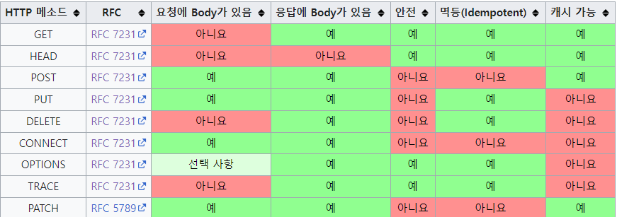

# HTTP 속성
* ### 안전(Safe Methods)
* ### 멱등(Idempotent Methods)
* ### 캐시가능(Cacheable Methods)

출처: https://ko.wikipedia.org/wiki/HTTP

## http 속성 안전이란?
* 어떠한 HTTP 요청이 서버의 상태나 데이터를 변경하지 않는다는 것을 의미
* 하나의 예로 GET 메서드는 주로 리소스 조회의 용도로 사용되기 때문에 리소스가 서버의 데이터나 상태를 변경하지 않으므로, 위 사진에서 보이는 것처럼 안전하다.
* 반면, POST는 요청 데이터의 처리나 등록을 하기 때문에 서버의 데이터나 상태를 변경할 수 있으므로 안전하지 않다.
* 즉, 호출해도 리소스의 변경이 이루어지지 않는 것을 안전하다라고 말한다.

## http 속성 멱등이란?
* f(f(x)) = f(x)
* HTTP 요청을 여러 번 반복해도 동일한 결과를 얻는다는 것을 의미한다.
* 멱등 메서드는 같은 요청을 여러 번 보내더라도 시스템의 상태나 데이터에 부작용이 발생하지 않는 것을 말한다.
* 멱등 요청이란 쉽게 말해 네트워크 문제로 인해 중복 전송될 수 있거나, 클라이언트에서 요청을 재시도할 때 유용하다.
* 멱등 메서드 예
  * GET : 멱등 OK, 어떠한 문제로 인해 여러번 조회해도 같은 결과가 조회된다.
  * PUT : 멱등 OK, 결과를 대체, 즉 어떠한 문제로 인해 여러번 호출되어도 결과가 똑같다.
  * DELECT : 멱등 OK, 결과를 삭제, 어떠한 문제로 같은 요청을 여러번 해도 삭제된 결과는 같다.
  * POST : 멱등 X, 예를들어 결제 기능이 멱등되는 경우 요청 횟수만큼 결제되기 때문에 멱등이 아니다.

## 멱등이 필요한 경우
* 자동 복구 메커니즘
* 예를 들어 서버에서 클라이언트한테 정상 응답을 주지 못했을 때, 클라이언트가 같은 요청을 다시 해도 되는가

## 캐시가능이란?
* 리소스를 클라이언트 웹 브라우저에서 저장 가능한 상태를 말함.