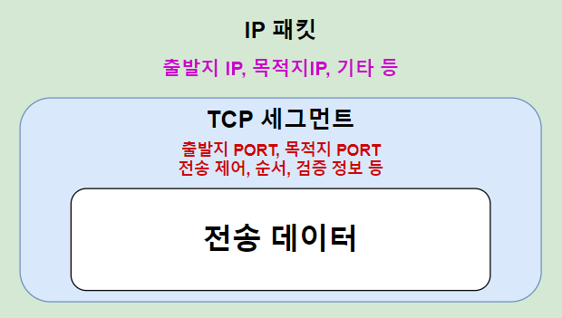

# 인터넷 통신
* 인터넷 통신은 컴퓨터와 다른 장치들이 인터넷을 통해 정보를 주고 받는 과정을 의미.
* 이 과정은 다양한 프로토콜과 기술을 사용하여 이루진다 
* **인터넷 통신망**: 인터넷은 전 세계적으로 분산된 여러 네트워크로 구성되어 있다. 네트워크들은 서로 다른 지리적 위치에 있는 여러 노드들로 구성되며, 이 노드들이 서로 연결되어 정보를 주고 받는다.
* **프로토콜과 기술**: 인터넷 통신은 다양한 프로토콜과 기술을 사용하여 이루어짐. 가령 TCP/IP 프로토콜 스택은 인터넷에서 데이터 전달을 담당하고, HTTTP/HTTPS, FTP, SMTP등은 인터넷을 통한 다양한 서비스와 응용프로그램에 사용되는 프로토콜이다.
* **노드**: 네트워크를 통해 장치 간 데이터를 주고받을 때, 여러 노드들을 거친다. 여기서 노드는, 네트워크에서 컴퓨터, 서버,라우터, 스위치 등의 장치를 의미한다. 이러한 노드들이 연결되어 데이터를 주고 받으며, 데이터가 노드 간에 전송된다.

# 인터넷 프로토콜 스택의 4계층
## * **애플리케이션 계층(응용 계층)**
* HTTP, FTP, SMTP, DNS 등: 이 계층에서는 데이터 포맷, 메시지 형식, UI 등을 다루며, 사용자 및 응용 프로그램에 서비스를 제공
## * **전송 계층**
* TCP, UDP: 장치간 신뢰성 있는 데이터 통신을 제공, 포트 번호를 사용하여 서비스나 프로세스를 식별하고, 송신자와 수신자 간의 연결 설정과 해제를 처리. 
## * **인터넷 계층** 
* IP, ICMP 등: 이 계층은 데이터 패킷을 목적지로 라우팅하고 패킷을 관리함. 
## * **네트워크 인터페이스(접속) 계층**
* 이 계층은 실제 물리적인 네트워크 하드웨어와 상호 작용함.
* 물리적인 매체(케이블, 무선 등)를 통해 데이터를 전송하고, MAC주소를 사용하여 장치를 식별함.
* 주로 이더넷, WIFI, 블루투스 같은 프로토콜이 사용된다.

# IP(Internet Protocol)
* 인터넷에서 데이터를 주고받기 위한 주요 프로토콜 중 하나
* 각각의 컴퓨터는 고유한 IP주소를 사용하며, 이 IP주소를 통해 네트워크 환경에서 장치 간 데이터를 주고받을 수 있다.
* 이때 장치 간 데이터를 주고 받을 때 패킷이라는 단위로 전송됨
* 패킷은 데이터 통신에서 정보를 더 작은 단위의 블록으로 쪼갠 것을 의미.
* IP패킷은 네트워크를 통해 전송되며, 각 IP패킷에는 **목적지 IP주소** , **출발지 IP주소**, **데이터 일부** 등이 포함됨.

## 그러나 IP프로콜만으로는 신뢰성 있는 데이터 전송을 보장할 수 없다. 
* IP프로토콜은 패킷을 받을 대상이 없거나 서비스 불능 상태여도 패킷을 전송함 (비연결성)
* 중간에 패킷이 사라지거나 순서가 보장되지 않을 수 있다. (비신뢰성)
* 이때, 신뢰성있는 데이터 전송을 담당하는 것이 TCP프로토콜이다.

# TCP(Transmission Control Protocol)
* 데이터의 신뢰성을 보장하고 순서를 지켜 데이터를 전송함.
* 신뢰성: 데이터 전송 중 데이터 손실을 최소화하고, 손실된 데이터를 재전송하여 데이터의 정확성을 보장
* 순서 보장: 데이터 패킷은 전송된 순서대로 순신되어 데이터의 일관성을 유지

## TCP/IP패킷
* IP패킷에서는 출발지 IP, 목적지 IP등이 포함되어 있음
* TCP세그먼트에는 출발지 PORT, 목저지 PORT, 전송제어, 순서, 검증 정보 등이 포함.

# 인터넷 프로토콜 스택의 4계층
