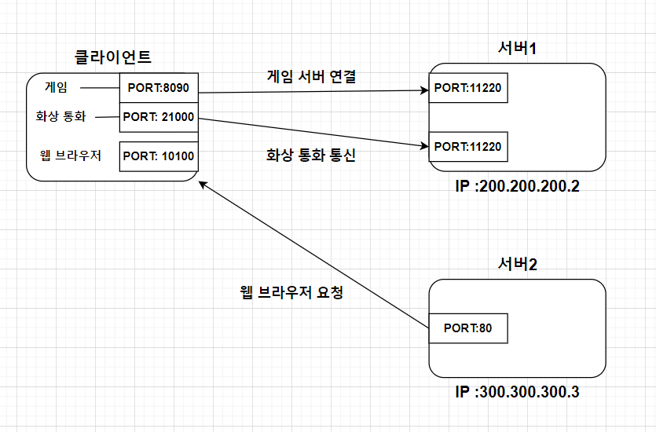

# Port
## 한번에 둘 이상 연결해야 한다면? (클라이언트가 여러 개 서버와 통신이 필요할 때)
* IP만 활용하면 이러한 다중 통신에 문제가 발생한다. 
* 이때 필요한 것이 PORT이며, 아래 TCP/IP 패킷 구조를 보면 TCP새그먼트에 출발, 목적 PORT가 구성되어있는 것을 확인할 수 있음.
  
* 즉, 아래와 같이 각 프로세스를 구분하는 것이 PORT임.

* 정리하자면 TCP/IP 패킷에서 IP를 통해 장치의 경로를 찾아갈 수 있는 것이고, PORT 번호로 프로세스 구분을 할 수 있는 것이다.
* 비유를 들면 IP가 아파트라면, PORT는 동호수라고 이해하면 편하다.

## Port number
* 0~65535: 할당 가능
* 0~1023: 잘 알려진 포트, 사용하지 않는 것이 좋음
* FTP -20, 21
* TELNET - 23
* HTTP - 80
* HTTPS - 443