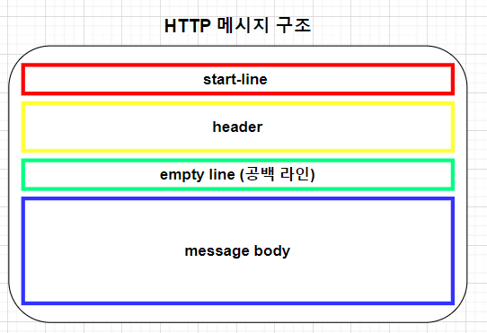
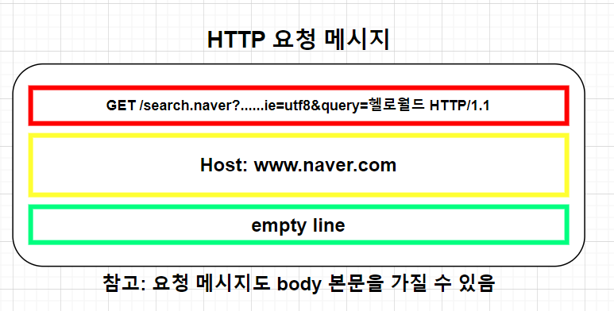
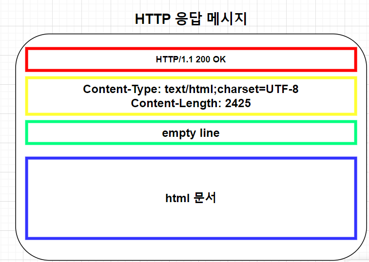

# HTTP(Hyper Text Transfer Protocol)

## HTTP란?
* 월드 와이드 웹(www)에서 정보를 주고받을 때 사용하는 대표적인 프로토콜이다. 
* 클라이언트와 서버 간의 통신을 위한 프로토콜
### * HTTP 메시지에 모든 것을 전송
* HTML, TEXT
* IMAGE, 음성 영상, 파일
* json, xml(api)
* 거의 모든 형태의 데이터 전송 가능

## 기반 프로토콜
* 현재 사용되는 HTTP 버전은 1.1, 2, 3이 사용된다.
* HTTP/1.1 버전이 가장 많이 사용되며, 2와 3은 1.1에서 성능이 개선된 형태.
#### * TCP: HTTP/1.1, HTTP/2
#### * UDP: 현재 HTTP/1.1을 주로 사용하며, HTTP 2, 3도 점점 증가하고 있는 추세

--------------------------------------------

# HTTP의 특징
* 클라이언트 서버 구조
* 무상태 프로토콜(Stateless)
* HTTP 메시지
* 단순함과 확장 가능

## 1.클라이언트 서버 구조
* 요청(request), 응답(response) 구조

### 클라이언트 (요청)
  * 클라이언트는 HTTP 요청을 생성하고 서버에 전송하는 역할을 함.

### 서버 (응답)
  * 클라이언트의 HTTP 요청을 받아서 처리하고 응답을 반환하는 역할을 함.
  * 서버는 클라이언트의 요청에 따른 리소스(웹페이지, 데이터, 이미지 등)울 제공하고 클라이언트에게 반환

### 클라이언트-서버 상호작용
  * *(클라이언트)* 웹 브라우저를 통해 URL을 입력하거나 링크를 클릭하는 등의 동작을 통해 웹 페이지를 '요청'
  *  클라이언트 요청이 HTTP 요청 메시지로 패키지되어 서버로 전송
  *  요청 메시지는 클라이언트의 요청 메서드(GET, POST 등)와 요청된 리소스(URL)을 포함
  * *(서버)* 서버는 받은 요청에 맞는 리소스를 찾고, 필요한 처리를 수행한 후 HTTP 응답 메시지를 생성하여 클라이언트에게 반환
  * *(클라이언트)* 응답받은 반환 값에 따라 클라이언트 측 UI에 해당 데이터가 로드 됨.

## 2.무상태 프로토콜 (stateless)
* 무상태 프로토콜이란 서버가 클라이언트의 상태를 보존하지 않는 상태를 말한다. 
* 즉, 각 HTTP 요청은 서로 독립적이며, 이전 요청에서의 정보나 상태를 서버는 기억하지 않는다. 
* 따라서, 서버는 각 요청을 처음부터 처리하고 클라이언트에 대한 이전 상태나 상호작용을 고려하지 않음.
* 장점: 확장성, 서버는 각 요청을 별도로 처리하고 서버가 클라이언트와 연결 정보를 유지할 필요가 없기 때문에 여러 클라이언트 요청을 효과적으로 처리할 수 있다.
  * 무상태는 연결 정보를 유지하지 않아서 응답 서버를 쉽게 바꿀 수 있으므로, 무한한 서버 증설 가능
  * 예를들어 같은 시간에 딱 맞추어 발생하는 대용량 트래픽(선착순 이벤트 등)에 대해 무상태로 서버를 설계하면 매우 유리하다.
* 단점: 클라이언트와 서버 간의 연속성을 제공하지 않는다는 점, 예를들어 로그인 상태를 유지하거나 이전 페이지에서의 상호작용을 유지하는 데 어려움을 줄 수 있음.
  * 모든 것을 무상태로 설계할 수 있는 경우도 있고 없는 경우도 있음. (단, 상태 유지는 최소한만 사용)
* 세션 및 쿠키: HTTP 무상태 프로토콜이지만(비연결성), 세션 관리 및 사용자 상태 유지를 위해 보통 쿠키와 세선과 같은 기술을 사용함.

## 3. HTTP 메시지
* HTTP 메시지 구조는 아래와 같다.
  

### 요청 메시지

#### 1. 시작 라인 (start-line = request-line)
* request-line = method SP(공백) request-target SP HTTP-version CRLF(엔터)
* *GET /search.naver?......ie=utf8&query=헬로월드 HTTP/1.1*
* GET: HTTP 메서드(GET: 조회)
  * HTTP 메서드 종류 :GET,POST,PUT,DELETE 등
  * 서버가 수행해야 할 동작 지정
  * GET: 리소스 조회
  * POST : 요청 내역 처리
* /search.naver?......ie=utf8&query=헬로월드: 요청 대상
  * path?query로 구성
* HTTP/1.1 : HTTP 버전

#### 2.헤더
* hearer-field = field-name ":" OWS field-value OWS (OWS: 띄어쓰기 허용이라는 뜻)
* Host: www.naver.com
* field-name은 대소문자 구문 없음

#### 3. 공백
#### 4. Body (요청은 포함될 수도있고 안될수도 있음.)

-------------------------------------------------------[]

### 응답 메시지

#### 1. 시작 라인 (start-line = status-line)
* HTTP/1.1 200 OK
* status-line = HTTP-version SP status-Code SP reason-phrase CRLF
* HTTP/1.1 : HTTP 버전
* 200 : 상태 코드, 요청 성공 또는 실패를 나타냄.
  * 200 : 성공
  * 400 클라이언트 요청 오류
  * 500: 서버 내부 오류
* OK : 사람이 이해할 수 있는 짧은 상태 코드를 설명하는 글

#### 2.헤더
* Content-Type: text/html;charset=UTF-8
  Content-Length: 2425
* hearer-field = field-name ":" OWS field-value OWS (OWS: 띄어쓰기 허용이라는 뜻)
* HTTP 전송에 필요한 모든 부가정보(메타데이터)
  * 예) 메시지 바디내용, 바디 크기, 압축, 인증, 서버 애플리케이션 정보, 캐시관리 정보 등
  * 필요시 임의의 헤더 추가 가능

#### 3. 공백
#### 4. body
* 실제 전송할 데이터
* HTML 문서, 이미지, 영상, JSON등 byte로 표현할 수 있는 모든 데이터 전송 가능

---------------------------------------------------
# 정리
### * HTTP 메시지에 모든 것을 전송한다
### * 클라이언트 서버 구조
### * 무상태 프로토콜(Stateless)
### * HTTP 메시지 구조