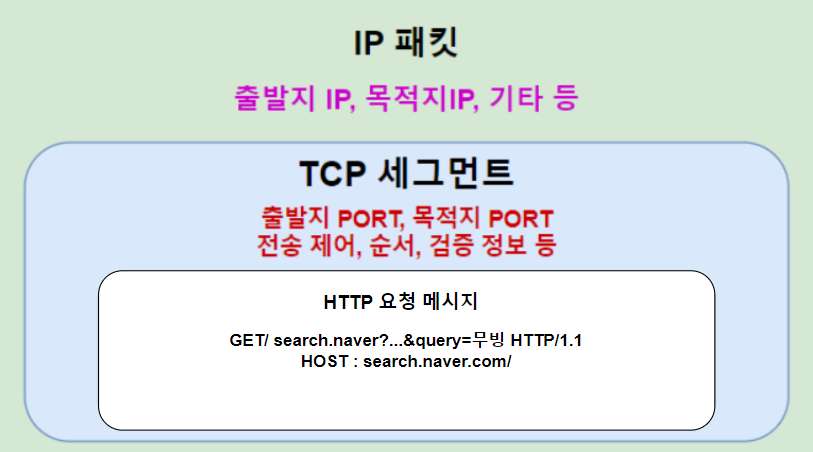
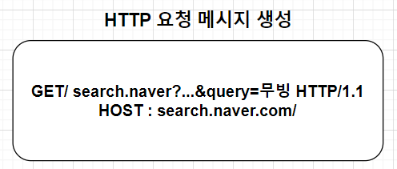
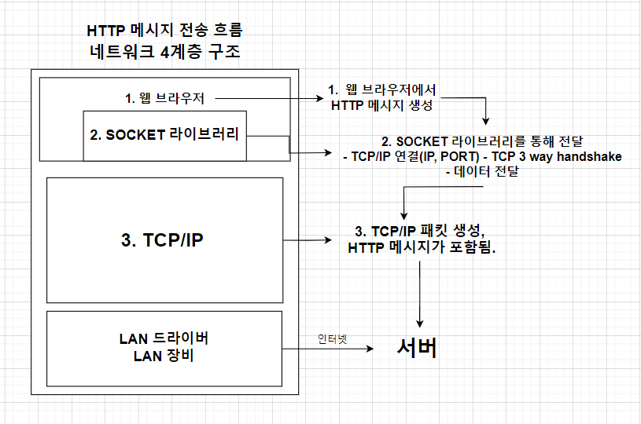
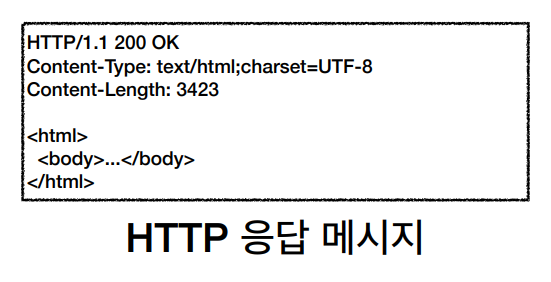

# 웹 브라우저 요청 흐름 (간략)
예를 들어 클라이언트가 아래 경로로 서버에 요청한다고 가정한다. 
* 예: https://search.naver.com/search.naver?where=nexearch&sm=top_hty&fbm=0&ie=utf8&query=무빙
1. 웹브라우저에서 URL을 읽어들여, HTTP 요청 메시지를 생성한다.
2. SOCKET 라이브러리를 통해 전달 (TCP/IP 연결 (IP, PORT)- TCP 3way handshake)
3. TCP/IP 패킷 생성, HTTP 메시지 포함(아래와 같은 형태)
   
4. 서버로 전송

## 요청 메시지

## 요청 흐름

### 이후 요청 패킷이 서버에 도착하고, 서버에서는 응답 패킷을 아래와 같은 형태로 전달한다.

* 응답 패킷이 클라이언트에게 전송된 후, 응답 메시지에 포함하고 있는 HTML 코드가 클라이언트 브라우저에 렌더링 된다.

